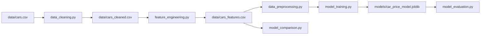

# Car Price Prediction

Reproduktivni Python projekat za istraživanje podataka o polovnim automobilima
i predviđanje njihove cene u američkim dolarima. Repozitorijum sadrži kompletan
machine-learning tok: EDA, čišćenje podataka, inženjering karakteristika,
pretprocesiranje, trening, evaluaciju i poređenje regresionih algoritama.

## Sadržaj

- [Funkcionalnosti](#funkcionalnosti)
- [Struktura projekta](#struktura-projekta)
- [Instalacija](#instalacija)
- [Brzi početak](#brzi-početak)
- [Pipeline](#pipeline)
- [Rezultati](#rezultati)
- [Programski API](#programski-api)
- [Artefakti](#artefakti)
- [Ograničenja](#ograničenja)

## Funkcionalnosti

- eksplorativna analiza 56.244 automobila u Jupyter notebook-u;
- standardizacija naziva kolona, tekstualnih i nedostajućih vrednosti;
- uklanjanje duplikata i fizički nevalidnih vrednosti;
- šest izvedenih karakteristika bez korišćenja ciljne promenljive;
- odvojeni numerički i kategorijski scikit-learn pipeline-i;
- reproduktivna podela na trening i test skup;
- trening i čuvanje kompletnog Ridge pipeline-a pomoću `joblib`;
- nezavisna evaluacija sačuvanog modela;
- poređenje Decision Tree, Random Forest i Gradient Boosting regresora.

## Skup podataka

Izvorni skup je `data/cars.csv`:

- 56.244 reda i 12 kolona;
- ciljna promenljiva: `priceUSD`, normalizovana u `price_usd`;
- numerički podaci: cena, godište, kilometraža i zapremina motora;
- kategorijski podaci: marka, model, stanje, gorivo, boja, menjač, pogon i
	segment.

Nakon čišćenja ostaju 55.842 reda. Uklanjaju se duplikati, redovi bez validne
ciljne promenljive i vrednosti van dokumentovanih fizičkih granica.

## Struktura projekta

```text
car-price-prediction/
├── data/
│   ├── cars.csv                 # izvorni, verzionisan skup
│   ├── cars_cleaned.csv         # generiše se, Git ignored
│   └── cars_features.csv        # generiše se, Git ignored
├── models/
│   └── car_price_model.joblib   # generiše se, Git ignored
├── notebooks/
│   └── 01_eda.ipynb             # izvršena eksplorativna analiza
├── src/
│   ├── data_cleaning.py
│   ├── feature_engineering.py
│   ├── data_preprocessing.py
│   ├── model_training.py
│   ├── model_evaluation.py
│   └── model_comparison.py
├── .gitignore
├── README.md
└── requirements.txt
```

## Instalacija

Potreban je Python 3.10 ili noviji. Iz korenskog direktorijuma projekta:

```powershell
python -m venv .venv
.\.venv\Scripts\Activate.ps1
python -m pip install --upgrade pip
python -m pip install -r requirements.txt
```

Na Linux-u i macOS-u aktivacija okruženja je:

```bash
source .venv/bin/activate
```

## Brzi početak

Kompletan tok se pokreće sledećim redosledom:

```powershell
python src/data_cleaning.py
python src/feature_engineering.py --reference-year 2026
python src/data_preprocessing.py
python src/model_training.py
python src/model_evaluation.py
python src/model_comparison.py
```

`--reference-year 2026` reprodukuje rezultate dokumentovane u ovom README-u.
Bez tog argumenta koristi se trenutna kalendarska godina.

Svaki skript podržava `--help`, na primer:

```powershell
python src/model_training.py --help
python src/model_evaluation.py --help
```

EDA se otvara komandom:

```powershell
jupyter notebook notebooks/01_eda.ipynb
```

## Pipeline



### Čišćenje podataka

`src/data_cleaning.py`:

- pretvara nazive kolona u `snake_case`;
- standardizuje `""`, `" "`, `NA`, `N/A`, `nan`, `null`, `none`, `None` i
	`NULL` u `pd.NA`;
- uklanja duplikate i redove bez marke, modela ili pozitivne cene;
- validira godište, kilometražu i zapreminu motora;
- popunjava zapreminu motora medijanom, a kategorijske vrednosti sa `unknown`;
- čuva rezultat kao `data/cars_cleaned.csv`.

### Inženjering karakteristika

`src/feature_engineering.py` dodaje:

| Karakteristika | Značenje |
|---|---|
| `car_age` | referentna godina minus godina proizvodnje |
| `mileage_per_year` | prosečna kilometraža po godini starosti |
| `engine_volume_liters` | zapremina motora u litrima |
| `is_newer_car` | indikator starosti do 10 godina |
| `is_high_mileage` | indikator kilometraže preko 300.000 km |
| `brand_model` | kombinacija marke i modela |

Rezultat se čuva kao `data/cars_features.csv`.

### Pretprocesiranje

`src/data_preprocessing.py` definiše:

- cilj: `price_usd`;
- osam numeričkih i devet kategorijskih karakteristika;
- `SimpleImputer(strategy="median")` i `StandardScaler` za numeričke podatke;
- `SimpleImputer(strategy="most_frequent")` i `OneHotEncoder` za kategorije;
- podelu 80/20 sa `random_state=42`.

`OrdinalEncoder` se ne koristi jer trenutne nominalne kategorije nemaju
opravdan prirodni redosled. Pretprocesiranje se fituje isključivo na trening
skupu kako bi se sprečilo curenje podataka.

### Trening i evaluacija

`src/model_training.py` trenira regularizovani Ridge baseline. Pretprocesiranje
i regresor čuvaju se zajedno kao `models/car_price_model.joblib`.

`src/model_evaluation.py` učitava taj artefakt i evaluira ga na reproduktivnom
test skupu bez ponovnog treniranja.

### Poređenje modela

`src/model_comparison.py` koristi isti split za:

- `DecisionTreeRegressor`;
- `RandomForestRegressor`;
- `GradientBoostingRegressor`.

Radi kontrolisane potrošnje memorije, retke kategorije se grupišu, broj One-Hot
kategorija po koloni ograničen je na 50, a sva tri modela dobijaju istu matricu
od 194 karakteristike. To su lagane baseline konfiguracije, ne rezultat
hiperparametarskog podešavanja.

## Rezultati

Svi rezultati koriste 44.673 trening i 11.169 test redova, uz
`random_state=42`.

### Sačuvani Ridge baseline

| Metrika | Rezultat |
|---|---:|
| MAE | 2.009,33 USD |
| RMSE | 3.958,93 USD |
| R² | 0,7790 |
| Poboljšanje MAE u odnosu na train-median baseline | 58,9% |

Model u proseku greši približno 2.009 USD. Veći RMSE pokazuje da postoje
pojedinačna vozila sa znatno većim greškama. R² pokazuje da model objašnjava
77,9% varijanse cena na test skupu.

### Poređenje tree-based modela

| Model | MAE (USD) | RMSE (USD) | R² |
|---|---:|---:|---:|
| Decision Tree | 1.393,29 | 3.732,14 | 0,8036 |
| Random Forest | 2.055,54 | 4.243,53 | 0,7460 |
| Gradient Boosting | 3.254,34 | 6.222,27 | 0,4540 |

Decision Tree ima najbolji rezultat među tri poređena modela na ovom test
splitu. To još nije konačan izbor za produkciju: stabilnost treba potvrditi
unakrsnom validacijom i podešavanjem hiperparametara.

## Programski API

Moduli se mogu koristiti i bez CLI-ja:

```python
import pandas as pd

from src.data_cleaning import clean_car_data
from src.feature_engineering import engineer_car_features
from src.data_preprocessing import build_preprocessor, create_train_test_split

raw_data = pd.read_csv("data/cars.csv")
cleaned_data = clean_car_data(raw_data)
featured_data = engineer_car_features(cleaned_data, reference_year=2026)

X_train, X_test, y_train, y_test = create_train_test_split(featured_data)
preprocessor = build_preprocessor()
X_train_transformed = preprocessor.fit_transform(X_train)
X_test_transformed = preprocessor.transform(X_test)
```

## Artefakti

| Putanja | Nastaje pomoću | Verzionisana | Napomena |
|---|---|---|---|
| `data/cars.csv` | izvorni podatak | da | jedini obavezni ulaz |
| `data/cars_cleaned.csv` | `data_cleaning.py` | ne | uvek se može regenerisati |
| `data/cars_features.csv` | `feature_engineering.py` | ne | uvek se može regenerisati |
| `models/car_price_model.joblib` | `model_training.py` | ne | sačuvani Ridge pipeline |

Modeli iz `model_comparison.py` postoje samo u memoriji tokom izvršavanja i ne
čuvaju se automatski. Nakon kloniranja repozitorijuma potrebno je pokrenuti
pipeline da bi se generisali ignorisani CSV i `joblib` fajlovi.

## Reproduktivnost

- split: `test_size=0.2`, `random_state=42`;
- referentna godina dokumentovanih rezultata: 2026;
- svi estimatori koji podržavaju `random_state` koriste istu vrednost;
- izvorni `cars.csv` se nikada ne prepisuje;
- generisani podaci i modeli isključeni su iz Git istorije.

## Ograničenja

- rezultati koriste jedan holdout split, bez unakrsne validacije;
- hiperparametri nisu sistematski optimizovani;
- skup sadrži vozila zaključno sa 2019. godinom;
- najbolji comparison model još nije sačuvan kao finalni artefakt;
- projekat još nema inference CLI, automatizovane testove ni verzionisanje
	modela.

Pre produkcijske upotrebe potrebno je sprovesti unakrsnu validaciju, podesiti
hiperparametre, izabrati i sačuvati finalni pipeline i dodati monitoring
kvaliteta predikcija.
